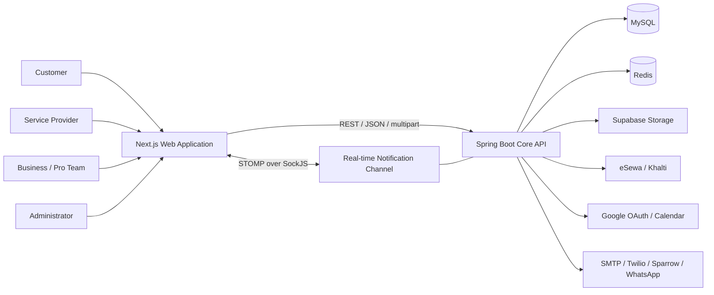
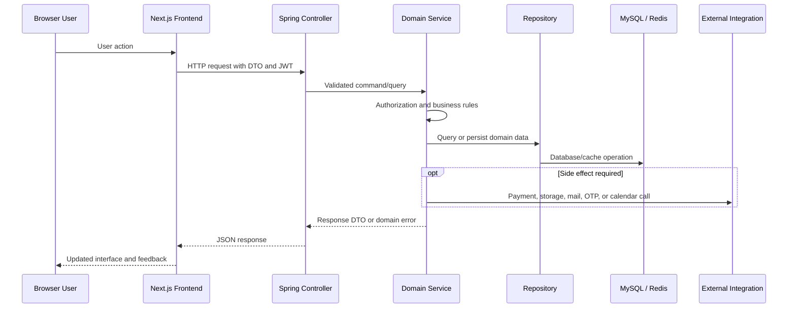
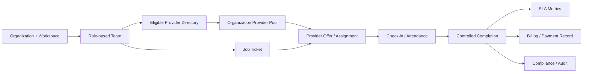
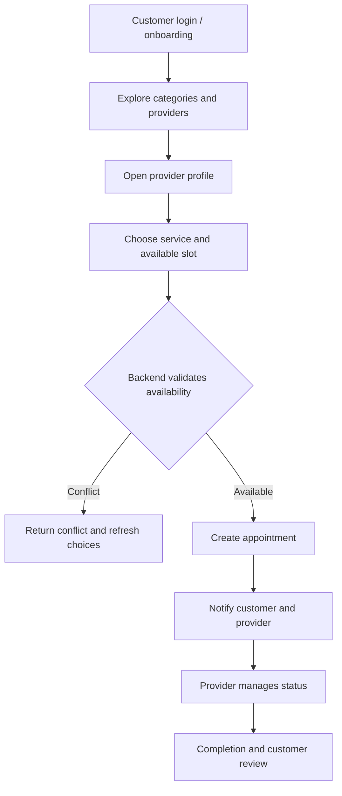

# ServiceLink Ecosystem: System Overview, Architecture, and Functionality

> **Document purpose:** A report-ready, repository-grounded overview of the complete ServiceLink ecosystem, including its product model, users, major workflows, system architecture, frontend and backend technology, data boundaries, integrations, security, deployment shape, and implementation considerations.
>
> **Evidence basis:** This document describes the code present in this repository as of **30 August 2026**. It separates implemented code structure from target-state ideas found in planning material. Runtime behavior can still vary with environment configuration and external service availability.

---

## 1. Executive summary

ServiceLink is a Nepal-focused, hybrid service marketplace with two connected operating models:

1. **Consumer marketplace (C2C):** individual customers discover verified local service providers, compare profiles and services, check availability, book time slots, manage appointments, and submit reviews.
2. **ServiceLink Pro (B2B):** organizations such as hotels, hospitals, and other businesses create workspaces, manage teams, source providers, maintain an approved provider pool, issue job tickets, monitor service delivery, and review operational, billing, SLA, and compliance information.

The ecosystem also contains dedicated experiences for **service providers** and **platform administrators**. Providers manage identity verification, public profiles, service offerings, schedules, bookings, subscriptions, portfolios, and performance insights. Administrators review KYC submissions, manage the service catalogue, oversee users/providers, and administer subscriptions.

Technically, ServiceLink is a web-based modular monolith:

- a **Next.js 16 / React 19 / TypeScript** frontend organized around App Router pages and role-specific dashboards;
- a **Spring Boot 4 / Java 17** backend exposing REST APIs and a STOMP-over-SockJS notification channel;
- **MySQL** for durable relational data;
- **Redis** for short-lived authentication and workflow state;
- external integrations for payments, media storage, OAuth, calendar synchronization, email, SMS, and WhatsApp communication.

The architecture is appropriate for an MVP and early production evolution: it keeps deployment straightforward while still separating domain responsibilities through controllers, services, repositories, DTOs, mappers, and role-specific frontend modules.

---

## 2. Product vision and ecosystem boundaries

ServiceLink addresses the gap between people or organizations needing reliable services and independent professionals offering those services. The platform is not only a directory: it coordinates trust, availability, booking, communication, payment-related verification, and post-service records.

### 2.1 Marketplace participants

| Actor | Primary purpose | Main capabilities |
| --- | --- | --- |
| Customer | Find and book local services | Register/login, verify identity and contact details, discover providers, inspect profiles and reviews, book or reschedule appointments, cancel bookings, track status, receive notifications, and review completed work. |
| Provider | Offer and deliver services | Register, complete KYC/onboarding, configure profile and service catalogue selections, manage schedule and exceptions, handle bookings, maintain portfolio, monitor analytics, manage subscription, and receive job/booking notifications. |
| Business user | Operate ServiceLink Pro | Register an organization, complete business setup/KYB, create a workspace, manage team members and roles, search the provider directory, maintain a provider pool, create and manage job tickets, and view SLA, billing, compliance, and operational dashboards. |
| Administrator | Govern platform trust and catalogue | Authenticate into the admin portal, review KYC, approve/reject or schedule audits, manage categories/services, inspect platform records, and administer provider and business subscriptions. |
| External service | Support a bounded platform capability | Process or verify payments, store uploaded media, send communications, provide OAuth identity, synchronize calendars, or deliver real-time transport. |

### 2.2 Core value streams

- **Trust:** KYC/KYB, verification status, reviews, provider credentials, admin decisions, and compliance views.
- **Discovery:** service categories, provider catalogue, filters, provider profiles, location-aware maps, ratings, and portfolio media.
- **Fulfilment:** provider schedules, availability calculation, appointments, rescheduling, provider status changes, Pro job tickets, assignment, and completion records.
- **Commercial operations:** provider subscriptions, business subscriptions, eSewa/Khalti flows, transaction verification, billing views, and receipts.
- **Engagement:** stored notifications, real-time updates, email, OTP, WhatsApp, and referral flows.

### 2.3 Scope boundaries

The repository represents an integrated marketplace and business-operations MVP. It is not designed as a microservice estate, ERP, payroll engine, advanced dispatch platform, or full accounting system. ServiceLink Pro planning material explicitly treats AI matching, complex fleet tracking, production escrow, enterprise SSO, and advanced accounting as out of current MVP scope.

---

## 3. Overall system architecture

### 3.1 Context view



### 3.2 Runtime and request flow



### 3.3 Architectural style

The backend is a **layered modular monolith**. All business domains run in one Spring Boot application, but code is grouped into identity, provider, appointment, notification, KYC, payment, and business/Pro areas. This reduces operational complexity while preserving logical module boundaries.

The frontend is a **single Next.js application with multiple role-specific portals**. Public marketing and authentication routes share the application with customer, provider, business, and admin dashboards. Components, API clients, Redux slices, hooks, and utility modules provide reuse across route families.

### 3.4 Primary architectural principles

- The backend is authoritative for authentication, authorization, ownership, state transitions, conflict detection, payment verification, and durable records.
- Controllers handle transport concerns; services implement use cases; repositories own persistence access.
- DTOs and mappers form an API boundary so JPA entities are not intended to become public contracts.
- MySQL stores durable business facts; Redis stores temporary or revocable workflow state.
- Uploaded media is stored outside the database, with references retained in relational records.
- Real-time notifications complement persisted notification records; they are not the sole source of truth.
- Role-specific user experiences may hide unavailable actions, but server-side checks remain mandatory.

---

## 4. Functional architecture by domain

### 4.1 Identity, authentication, and account lifecycle

The identity domain supports registration, credential login, token refresh, logout, current-user profile operations, password reset, email/phone OTP, provider-specific verification, Google OAuth2, and two-factor authentication.

The backend uses stateless JWT access authentication. A JWT filter reads bearer tokens and establishes the authenticated principal. Refresh-token state is managed through Redis so sessions can expire or be revoked independently of an access token. Passwords are encoded with BCrypt. TOTP support and backup-code-related endpoints provide a second authentication factor.

The frontend contains separate customer, provider, business, and admin login/registration routes. Authentication state is reflected in centralized state and role-aware navigation. Device information and provider PIN flows add a provider-specific security layer.

### 4.2 Customer discovery and booking

The customer journey is represented by dashboard, explore, map, provider-profile, booking, tracking, review, notification, and settings pages.

Typical flow:

1. Customer authenticates and completes any required onboarding.
2. The explore experience loads categories and provider catalogue data.
3. The customer opens a provider profile containing profile summary, services/pricing, coverage, availability, credentials, portfolio, rating breakdown, and reviews.
4. The customer describes the issue and selects an available time.
5. The backend validates provider/service data and booking conflicts before creating the appointment.
6. The customer can list, inspect, cancel, track, or reschedule the booking subject to domain rules.
7. A paid reschedule can initiate and verify a gateway transaction before the schedule is changed.
8. Notifications and email communicate key lifecycle events.
9. A review flow is available after service completion.

### 4.3 Provider onboarding and operations

Providers have dedicated registration, verification, PIN, onboarding, profile, availability, bookings, earnings, analytics, subscription, referral, notifications, and settings experiences.

The provider domain covers:

- provider identity and registration;
- KYC and profile verification state;
- category and service selection from the shared catalogue;
- provider-specific pricing/service configuration;
- weekly schedule settings, availability, and date exceptions;
- portfolio media and public reviews;
- appointment lists, details, calendar views, statistics, and allowed status transitions;
- subscription checkout/status and administrative overrides;
- referral and device/PIN workflows;
- insights and operational dashboard summaries.

Public catalogue routes expose provider discovery information, while `/api/providers/me/**`-style operations are protected. Security matcher ordering explicitly prevents the literal `me` route from being mistaken for a public provider identifier.

### 4.4 Trust: KYC, KYB, and administration

Customer/provider KYC includes submission, status lookup, current submission retrieval, receipt/status screens, document upload, and an admin decision workflow. The admin can list pending submissions, inspect details, approve, reject, or schedule a video audit.

Business onboarding includes organization and KYB concepts, workspace setup, administrator identity, plan selection, payment, and readiness steps. Compliance pages are intended to summarize organization verification, provider verification, work/payment references, and supporting audit information.

The admin portal also manages the shared service catalogue and provider/business subscription operations. It acts as the governance layer for marketplace quality and platform controls.

### 4.5 Availability and scheduling

Availability is a cross-cutting domain connecting provider schedule settings, explicit availability, exceptions/blackout periods, customer appointments, and Pro job assignments.

Backend services include schedule settings, availability, exception handling, and an availability resolver. Appointment creation and rescheduling rely on backend validation, with booking-specific conflict errors represented by `BookingConflictException`.

For a consistent ecosystem, confirmed consumer appointments and accepted Pro assignments should share a single conflict policy. The repository’s Pro planning specification identifies this as a critical invariant: neither side should be able to create an overlapping confirmed commitment.

### 4.6 Payments and subscriptions

ServiceLink integrates Nepal-local eSewa and Khalti gateways. Payment code is divided between gateway adapters/orchestration and domain-specific subscription or appointment workflows.

The safe lifecycle is:

```text
Local pending transaction
    -> gateway initiation
    -> browser redirect/callback
    -> backend verification with gateway
    -> atomic update of transaction and related domain record
    -> receipt/status response
```

The frontend contains common payment callback utilities and role-specific success/failure/callback pages. The backend includes provider-subscription management, business-subscription payment services, payment properties, gateway verification URLs, and administrative subscription history/extension/revocation operations.

Gateway redirects are signals, not proof of payment; the backend verification result must remain authoritative.

### 4.7 Notifications and communications

Notifications are persisted and can be queried, counted, marked read individually, or marked read in bulk. Preference endpoints allow category-level controls.

For immediate delivery, the frontend connects with STOMP and SockJS to `/ws`, authenticates the STOMP connection using a bearer token, and subscribes to the private `/user/queue/notifications` destination. The backend validates the token on `CONNECT` and restricts subscriptions to that private notification queue.

Additional communication channels include SMTP email, Twilio WhatsApp capabilities, WhatsApp deep links, and configured Sparrow SMS support. These channels should be treated as delivery mechanisms around database-backed workflow state.

### 4.8 ServiceLink Pro: organization operations

ServiceLink Pro adds an organization/workspace layer above the shared provider marketplace.

Implemented code surfaces include organization setup, workspace and team-member services, business subscriptions and payments, provider directory/pool modules, job-ticket APIs, and business dashboard routes for jobs, provider pool, directory, SLA, billing, compliance, notifications, and settings.

The intended Pro operating model is:



Key domain distinctions:

- **Directory is not Pool:** the directory is the wider eligible ServiceLink network; a pool is an organization-specific trusted set.
- **Offer is not confirmed assignment:** a provider must be able to accept or decline; acceptance is the point at which availability and rate should be revalidated and locked.
- **Job status is not assignment status:** staffing progress and provider responses require separate state machines.
- **Global rating is not Pro performance:** marketplace reviews and business-specific attendance/SLA measures should remain separate.
- **Historic records survive eligibility changes:** hiding a provider from new Pro selection should not erase prior assignments, pool history, billing, or audit evidence.

The repository also contains a detailed target-state Pro specification. Features described there—particularly complete offer state machines, shared C2C/Pro conflict locking, QR/geofence attendance, comprehensive audit trails, and fully evidence-based dashboards—must be verified end to end before being described as production-complete.

---

## 5. Frontend architecture and technology

### 5.1 Technology overview

| Technology | Repository version | Role |
| --- | --- | --- |
| Next.js | 16.2.4 | App Router, routing, layouts, application build/runtime, and React integration. |
| React / React DOM | 19.2.4 | Component-based user interfaces and client-side interaction. |
| TypeScript | 5.x | Static typing for pages, components, APIs, state, hooks, and utilities. |
| Tailwind CSS | 4.x | Utility-based styling through the PostCSS integration. |
| Redux Toolkit / React Redux | Root dependency set | Centralized role, workflow, preferences, booking, notification, KYC, and administration state. |
| Axios | 1.15.x | REST API transport, including authenticated requests and token handling. |
| Zod | 4.4.x | Client-side schema validation, notably KYC validation. |
| STOMP.js + SockJS | 7.3.x / 1.6.x | Real-time notification connection to Spring WebSocket messaging. |
| Leaflet + React Leaflet | 1.9.x / 5.x | Map display, provider coverage, location, and selection interfaces. |
| jsPDF + html2canvas | 4.2.x / root dependency | Receipt/report-style client PDF generation and DOM capture. |
| Recharts | Root dependency set | Dashboard charts and analytical visualization. |
| Lucide / React Icons | Current package sets | Interface iconography. |
| React Toastify | 11.1.x | User feedback and transient notifications. |

The frontend package currently relies on some dependencies declared in the repository-level `package.json` rather than only in `frontend/servicelink/package.json`. Consolidating application dependencies into the frontend package would make installation and CI behavior more deterministic.

### 5.2 Route organization

The application uses route groups and nested layouts. Its approximately 67 page modules fall into these families:

- public landing and informational content;
- customer/provider/business registration;
- customer/provider/business/admin authentication and callbacks;
- KYC submission, receipt, and status verification;
- customer dashboard: home, explore, map, bookings, tracking, reviews, notifications, and settings;
- provider dashboard: profile, services, availability, bookings, analytics, earnings, subscription, referral, notifications, and settings;
- business dashboard: overview, directory, provider pool, jobs, SLA, billing, compliance, notifications, and settings;
- admin dashboard: users, providers/catalogue, KYC, and subscriptions;
- payment and OAuth callback routes.

### 5.3 Component organization

Components are grouped by business role and feature:

```text
components/
├── home/                    Marketing and public landing sections
├── layout/                  Shared navigation and footer
├── dashboard/user/          Customer dashboard and booking/discovery UI
├── dashboard/provider/      Provider operations UI
├── dashboard/business/      ServiceLink Pro dashboards and navigation
├── dashboard/admin/         Platform administration UI
├── business/                Business onboarding, jobs, and payments
├── kyc/                     KYC wizard, receipt, and status components
├── notifications/           Notification center, preferences, bootstrap
├── provider/auth/           Provider PIN and device-related authentication
└── ui/ and shared/          Reusable presentation components
```

### 5.4 State management

Redux slices cover user/session data, UI state, onboarding, provider profile/services/availability/bookings/subscription/preferences, business auth/setup, notifications, KYC, categories, and admin subscription/provider-directory/provider-pool functions.

`BusinessSetupContext` coordinates multi-step business registration/setup state. Local component state is used for page-level dialogs, forms, filters, loading behavior, and temporary interactions. This hybrid structure is reasonable when long-lived cross-page state stays centralized and ephemeral presentation state stays local.

### 5.5 API and authentication layer

The frontend includes domain API modules for authentication, OTP, KYC, providers, provider KYC, onboarding, organizations, subscriptions, portfolios, jobs, appointments, insights, storage, smart estimation, and admin subscription operations.

Two Axios implementations currently coexist (`utils/axios.ts` and clients under `lib/api`). This can produce inconsistent base URLs, interceptors, token refresh behavior, and error serialization. A single canonical client with domain-specific wrappers would reduce authentication and maintenance risk.

Client-side guards and permission-aware navigation improve user experience, but they do not replace backend authorization.

### 5.6 Frontend rendering considerations

- Interactive dashboards and browser-only integrations use client components where needed.
- Leaflet map rendering must remain client-side because it depends on browser APIs.
- Route layouts provide role-specific navigation shells.
- Images and brand assets are stored under `public/images`.
- Translation hooks and a translation utility indicate multilingual UI support or preparation.
- PDF receipts are generated in the browser for KYC/payment-style reporting experiences.

---

## 6. Backend architecture and technology

### 6.1 Technology overview

| Technology | Repository version/configuration | Role |
| --- | --- | --- |
| Java | 17 target | Backend language and runtime target. |
| Spring Boot | 4.0.4 parent | Application bootstrap and dependency platform. |
| Spring Web MVC | Starter | REST endpoints, JSON, validation integration, and multipart handling. |
| Spring Security | Configured filter chain | JWT authentication, OAuth2 login, RBAC, CORS, password encoding, and method security. |
| Spring Data JPA / Hibernate | Starter | ORM and repository abstraction for durable entities. |
| MySQL Connector/J | Runtime | MySQL database connection. |
| Spring Data Redis / Lettuce | Starter/default client | Refresh tokens, PIN attempts, and registration-session state. |
| Spring WebSocket | Starter | STOMP/SockJS real-time notifications. |
| Spring Mail | Starter | SMTP email delivery. |
| JJWT | 0.11.5 | JWT creation, parsing, and validation. |
| TOTP | 1.7.1 | Time-based one-time passwords for 2FA. |
| Spring OAuth2 Client | Starter | Google login integration. |
| Google Calendar API | 2026 revision dependency | Provider calendar integration. |
| Twilio SDK | 10.4.1 | WhatsApp/OTP communication support. |
| Springdoc OpenAPI | 2.5.0 | Generated API documentation and Swagger UI. |
| Apache HttpClient 5 | 5.2.1 | Outbound HTTP integration. |
| Lombok | 1.18.30 | Compile-time boilerplate reduction. |

### 6.2 Source structure

```text
backend/src/main/java/com/servicelink/core/
├── CoreApplication.java     Spring Boot entry point and async enablement
├── config/                  Security, CORS, WebSocket, Redis, payment, bootstrap
├── controller/              HTTP API boundary, grouped by domain
├── dto/                     Request, response, cache, and workflow contracts
├── exception/               Typed domain failures and global HTTP handling
├── mapper/                  Entity/DTO conversion
├── model/                   JPA entities and enums
├── payment/                 Gateway abstraction and eSewa/Khalti handling
├── repository/              Spring Data persistence interfaces
├── security/                JWT, OAuth success handling, filters, organization context
├── service/                 Use cases, transactions, rules, integrations
└── storage/                 Storage abstraction and Supabase implementation
```

Repository inventory at the document date identifies roughly **32 REST controllers, 35 JPA entities, and 33 Spring Data repositories**. Counts are implementation indicators, not stability guarantees.

### 6.3 Request-processing contract

1. A controller receives and validates the transport request.
2. Spring Security and method-level guards establish role and access requirements.
3. A service performs ownership checks, business validation, state transitions, transaction management, and integration orchestration.
4. Repositories read/write JPA entities.
5. Mappers return response DTOs rather than exposing persistence models directly.
6. `GlobalExceptionHandler` converts known failures into structured HTTP errors.

### 6.4 API families

| Domain | Principal route family | Representative responsibility |
| --- | --- | --- |
| Authentication | `/api/auth/**` | Registration, login, refresh, logout, profile, OTP, reset, provider verification, and 2FA login. |
| Users | `/api/users/**` | User profile/admin operations, password, image, onboarding, deletion, and 2FA management. |
| Providers | `/api/providers/**` | Public catalogue and reviews; authenticated self-profile, services, availability, portfolio, PIN, referrals, and insights. |
| Appointments | `/api/appointments/**` | Customer booking/list/detail/cancel/stats; provider booking views/status/calendar; rescheduling and token/payment operations. |
| KYC | `/api/kyc/**`, `/api/admin/kyc/**` | Submission/status/reference lookup and admin approval/rejection/audit. |
| Notifications | `/api/notifications/**` | Persist, list, unread count, read state, and preferences. |
| Business auth/setup | `/api/auth/business/**`, `/api/business/**` | Business OTP/login/reset, organization, workspace, KYB, team, Pro user, and subscriptions. |
| ServiceLink Pro | `/api/pro/**` | Provider directory/pool, job tickets, assignments, and dashboard-oriented operations. |
| Administration | `/api/admin/**` | KYC, provider catalogue, and provider/business subscription administration. |
| Storage/media | `/api/storage/**`, `/api/media/**` | Multipart/object upload workflows. |

When the application is running, generated OpenAPI documentation should be used as the definitive low-level endpoint contract.

### 6.5 Persistence model

MySQL holds durable data across these aggregate families:

- users, roles, profiles, verification, and KYC;
- providers, categories, service catalogue entries, provider services, reviews, and portfolios;
- schedules, availability, exceptions, appointments, reschedule tokens, and payment transactions;
- provider subscriptions and their history;
- notifications and preferences;
- organizations, workspaces, business users, team members, invitations, KYB, plans, subscriptions, and payment history;
- Pro provider directory/pool and job-ticket-related records.

The development configuration uses Hibernate schema update. This is convenient for local evolution, but production should use versioned migrations (for example Flyway or Liquibase) and a controlled validation/update policy.

Redis is deliberately non-authoritative for permanent business facts. It supports revocable refresh-token state, rate/attempt tracking for provider PIN flows, and temporary business-registration sessions.

---

## 7. Security architecture

### 7.1 Authentication and session model

- Stateless bearer-token authentication for REST APIs.
- JWT validation before Spring’s username/password authentication filter.
- Redis-backed refresh-token lifecycle and logout/revocation behavior.
- BCrypt password hashing.
- Google OAuth2 login path.
- TOTP-based two-factor support and backup-code management endpoints.
- Provider PIN/device checks for provider-specific sign-in flows.

### 7.2 Authorization model

- `/api/admin/**` requires the `ADMIN` role.
- appointment routes require authentication and are further restricted by customer/provider method guards.
- provider public catalogue `GET` routes are exposed selectively; self-management routes require authentication.
- category/catalogue mutation has URL-level and method-level admin protection.
- business invitation lookup/acceptance has narrow public exceptions; the wider `/api/business/**` area requires authentication.
- organization-aware request handling includes a current-organization argument resolver for business operations.

### 7.3 Browser and transport controls

- CORS currently permits local frontend origins `http://localhost:3000` and `http://localhost:3001` with credentials.
- CSRF is disabled because the API is designed around stateless bearer tokens.
- The SockJS handshake is public, while STOMP `CONNECT` requires a bearer token and subscriptions are restricted to the private notification queue.

### 7.4 Security considerations for production

- Move every credential and secret to environment or secret-manager storage; never commit real values.
- Restrict production CORS to exact HTTPS origins.
- Review the currently broad public KYC and upload matchers and require the minimum access necessary.
- Add upload content-type, size, malware, and ownership validation.
- Rate-limit authentication, OTP, reset, upload, and verification endpoints.
- Rotate JWT, payment, OAuth, Twilio, SMTP, and storage credentials on a defined schedule.
- Avoid sensitive SQL/security debug logs in production.
- Add audit events for administrative, payment, verification, and critical business state changes.
- Revalidate role, ownership, state, amount, and idempotency for every high-impact mutation.

---

## 8. External integrations

| Integration | Purpose | Architectural note |
| --- | --- | --- |
| Supabase Storage | Profile, portfolio, KYC/KYB, and other uploaded media | Backend storage abstraction should own credentials; database stores object references/URLs. |
| eSewa | Nepal-local payments | Initiation must be followed by backend verification before success is persisted. |
| Khalti | Nepal-local payments | Same server-authoritative verification rule as eSewa. |
| Google OAuth2 | External login | OAuth success handler bridges Google identity into ServiceLink authentication. |
| Google Calendar | Provider schedule/calendar interoperability | Requires valid OAuth configuration and refresh-token lifecycle management. |
| SMTP | Email verification and workflow notifications | Async execution prevents email latency from blocking primary requests. |
| Twilio / WhatsApp | OTP and messaging | Credentials, sender configuration, templates/content IDs, and sandbox/production status affect behavior. |
| Sparrow SMS | SMS delivery support | Configuration exists; actual enabled behavior should be environment-verified. |
| Leaflet/OpenStreetMap ecosystem | Browser maps and location display | Client-only map rendering; production usage should respect tile-provider terms and rate limits. |

External integrations should be wrapped by service interfaces, timed out, retried only where safe, and observed separately from core request success. Payment verification and notification retries require idempotency to prevent duplicate financial or user-visible effects.

---

## 9. Representative end-to-end workflows

### 9.1 Customer booking workflow



### 9.2 Provider onboarding workflow

```text
Register -> verify email/phone -> authenticate/PIN -> complete KYC
-> configure profile/services -> configure availability -> publish profile
-> receive and manage appointments -> maintain portfolio/reviews/insights
```

### 9.3 Business onboarding workflow

```text
Verify business email -> create organization -> provide KYB information
-> create workspace/admin -> choose plan -> initiate and verify payment
-> invite team members -> enter ServiceLink Pro dashboard
```

### 9.4 ServiceLink Pro job workflow

```text
Create job ticket -> identify eligible provider(s) -> offer/assign
-> provider decision -> conflict recheck and assignment confirmation
-> attendance/check-in -> in-progress service -> controlled completion
-> SLA calculation -> billing/payment record -> compliance/audit visibility
```

The last workflow represents the intended integrated Pro lifecycle. Individual APIs and screens exist, but its full state, authorization, attendance, billing, and dashboard behavior must be validated against real database records before a production-complete claim.

---

## 10. Deployment and operational picture

### 10.1 Local topology

```text
Browser:             http://localhost:3000
Next.js frontend:    frontend/servicelink
Spring Boot API:     backend (configured server port)
MySQL:               servicelink database
Redis:               local configured host/port
External services:   credentials supplied through environment configuration
```

Basic startup:

```bash
# Backend
cd backend
./mvnw spring-boot:run

# Frontend (separate terminal)
cd frontend/servicelink
npm install
npm run dev
```

The repository README states Java 21 as a prerequisite, while `pom.xml` compiles and targets Java 17. The build file is the stronger implementation authority; documentation and CI should be aligned on one supported JDK policy.

### 10.2 Production deployment shape

A straightforward production topology would contain:

- CDN/reverse proxy and HTTPS termination;
- Next.js application runtime;
- one or more Spring Boot application instances;
- managed MySQL with backups and point-in-time recovery;
- managed Redis with authentication, persistence policy, and monitoring;
- Supabase object storage;
- environment-specific OAuth, payment, email, and messaging credentials;
- centralized logs, metrics, traces, alerts, and audit retention.

The current in-memory Spring simple message broker is naturally single-instance. Horizontal backend scaling requires sticky/compatible WebSocket routing plus a shared message broker or an equivalent distributed notification mechanism.

### 10.3 Configuration groups

Sensitive values are intentionally omitted from this report. Runtime configuration covers:

- frontend/backend URL and CORS origins;
- MySQL connection and Hibernate policy;
- Redis connection and timeouts;
- JWT key and expiration periods;
- Google OAuth and Calendar credentials;
- SMTP credentials;
- Supabase URL, bucket, and API key;
- eSewa and Khalti gateway endpoints and credentials;
- Twilio/WhatsApp and Sparrow SMS settings;
- multipart upload limits and async executor sizing.

---

## 11. Quality, testing, and observability

### 11.1 Current repository signal

The backend test tree currently exposes a minimal Spring context test. A platform with booking conflicts, money movement, RBAC, verification, and multi-actor state transitions needs substantially broader automated coverage.

### 11.2 Recommended test pyramid

- **Unit tests:** pricing, transition rules, token parsing, availability overlap, geofence calculations, eligibility, mapping, and error codes.
- **Repository tests:** entity constraints, indexes, queries, organization isolation, uniqueness, locking, and history retention.
- **Controller/security tests:** public/protected routes, every role, object ownership, invalid JWTs, CORS, validation, and structured errors.
- **Integration tests:** MySQL/Redis behavior, payment verification adapters, storage boundaries, email/notification events, and transactional rollback.
- **Frontend tests:** reducers, hooks, schema validation, guards, form behavior, loading/error/empty states, and component accessibility.
- **End-to-end tests:** registration, KYC/admin approval, customer booking, provider updates, reschedule payment, business setup, provider pool, and Pro job lifecycle.

### 11.3 Critical negative scenarios

- overlapping bookings are rejected consistently;
- an unauthorized role cannot mutate another actor’s or organization’s data;
- duplicate pool entries, assignments, payments, or check-ins are rejected;
- gateway redirect parameters cannot mark a payment successful without server verification;
- invalid/expired OTP, refresh, reschedule, invite, and attendance tokens fail safely;
- declined or expired offers do not incorrectly close a Pro job;
- completed/cancelled jobs cannot restart;
- disabled/hidden providers disappear from new selection but retain history;
- upload endpoints reject unsupported content and unauthorized ownership;
- WebSocket clients cannot subscribe to another user’s events.

### 11.4 Observability

Production reporting should include:

- request rate, latency, and error rate by endpoint;
- authentication/OTP failure and lockout trends;
- booking conflicts and appointment transition failures;
- payment initiation, verification success/failure, and reconciliation mismatches;
- email/SMS/WhatsApp delivery outcomes;
- WebSocket connection and delivery metrics;
- database pool, slow-query, Redis latency, and cache error metrics;
- provider supply, booking conversion, fulfilment, cancellation, repeat booking, SLA, and revenue/business subscription metrics;
- immutable audit reporting for admin decisions and high-impact mutations.

Avoid logging tokens, passwords, OTP values, personal documents, payment secrets, or unnecessary personally identifiable information.

---

## 12. Current strengths, gaps, and risks

### 12.1 Strengths

- A coherent product model serving customers, providers, organizations, and administrators.
- Clear backend layering and broad domain separation inside a deployable monolith.
- Strong local-market fit through eSewa, Khalti, WhatsApp, and Nepal location data.
- Dedicated trust, scheduling, notification, and subscription domains.
- Role-specific frontend portals rather than a single overloaded dashboard.
- Real-time notifications backed by persistent notification records.
- Reuse of a common provider/service ecosystem across consumer and Pro experiences.

### 12.2 Known architectural gaps or inconsistencies

1. **Dependency split:** Redux, charting, QR, and capture dependencies are declared at repository root while the Next.js app has its own package manifest.
2. **Duplicate HTTP client patterns:** two Axios approaches can diverge in token and error behavior.
3. **JDK documentation mismatch:** README says Java 21; Maven compiles for Java 17.
4. **Schema management:** `ddl-auto=update` is not a production migration strategy.
5. **Limited tests:** existing automated backend coverage is far below the risk level of the domain.
6. **Broad public matchers:** KYC/storage exposure deserves a least-privilege review.
7. **Single-instance messaging:** the simple STOMP broker does not by itself support horizontally scaled delivery.
8. **Pro completeness:** target-state material describes stricter lifecycle, attendance, conflict, audit, and reporting behavior than should be assumed merely from page/controller presence.
9. **Configuration hygiene:** local properties include many integration knobs; deployment must guarantee that secrets remain outside version control and logs.
10. **Operational readiness:** health checks, migrations, reconciliation, idempotency, alerting, and disaster-recovery evidence are not comprehensively documented in the current repository.

### 12.3 Recommended priorities

**Priority 1 — correctness and security**

- unify authorization and ownership tests;
- audit public endpoints and uploads;
- implement versioned database migrations;
- enforce idempotent payment verification and reconciliation;
- unify C2C and Pro conflict protection;
- add integration tests for high-risk state transitions.

**Priority 2 — frontend consistency**

- consolidate dependencies into the frontend package;
- standardize one Axios/token-refresh/error client;
- replace remaining mock/static dashboard data with typed API responses;
- standardize loading, empty, error, permission, and retry states.

**Priority 3 — production operations**

- externalize and rotate secrets;
- add metrics, tracing, audit logs, and business dashboards;
- plan shared WebSocket messaging for multiple backend instances;
- define backup, restore, incident, and payment-reconciliation procedures.

---

## 13. Suggested reporting model

For project, academic, stakeholder, or investor reports, ServiceLink can be described through five measurable layers:

| Report layer | Question answered | Example measures |
| --- | --- | --- |
| Reach | Who is using the ecosystem? | Registered customers/providers/businesses, verified providers, active organizations, geographic coverage. |
| Marketplace | Are customers finding appropriate supply? | Search-to-profile conversion, availability rate, booking conversion, time to booking, category demand. |
| Fulfilment | Are services delivered reliably? | Acceptance rate, cancellation rate, completion rate, reschedules, conflict rate, provider response time. |
| Trust and quality | Is the ecosystem safe and useful? | KYC/KYB approval time, review scores, complaints, late/missing attendance, SLA attainment, admin actions. |
| Commercial health | Is the model sustainable? | Verified payment volume, provider/business subscriptions, monthly spend, platform fees, failed payment rate, repeat booking. |

Every metric should define its source entity, date basis, status inclusion rules, actor/organization scope, and treatment of cancelled or refunded records. Dashboard values should be calculated server-side from authoritative data rather than inferred from frontend state.

---

## 14. Repository map and source of truth

| Path | Purpose |
| --- | --- |
| `README.md` | Concise product and local setup introduction. |
| `frontend/servicelink/app/` | Next.js routes, layouts, and portal entry points. |
| `frontend/servicelink/components/` | Role- and feature-oriented interface components. |
| `frontend/servicelink/lib/api/`, `services/`, `utils/` | API transport, workflow clients, authentication/payment helpers, and presentation utilities. |
| `frontend/servicelink/store/` | Redux store, slices, and typed hooks. |
| `backend/pom.xml` | Authoritative backend dependency and Java target configuration. |
| `backend/src/main/java/com/servicelink/core/` | Backend application, APIs, business logic, persistence, security, and integrations. |
| `backend/src/main/resources/application.properties` | Runtime configuration keys and local defaults; values must be handled as sensitive. |
| `servicelink_reweaer.md` | Earlier backend-focused implementation reference. |
| `servicelink_frontend_reweaer.md` | Earlier frontend-focused implementation reference. |
| `servicelink_pro_backend_master_prompt.md` | Target-state ServiceLink Pro implementation specification; not itself evidence that every described feature is complete. |

The live code and generated OpenAPI contract are authoritative for current behavior. Planning documents describe intent. This distinction should be maintained in all formal reporting.

---

## 15. Conclusion

ServiceLink is an ambitious but coherent service ecosystem: a consumer marketplace, provider operations platform, business sourcing portal, and administrative trust layer built on a shared identity, service catalogue, availability, payment, and notification foundation.

Its frontend presents specialized journeys for each actor through a modern Next.js/React stack. Its backend centralizes business rules in a Spring Boot modular monolith backed by MySQL and Redis, with integrations suited to the Nepal market. The current structure provides a solid base for iterative delivery; the next maturity step is not a wholesale rewrite, but disciplined consolidation—shared availability rules, stronger tests, production database migrations, consistent API clients, strict security boundaries, verified Pro lifecycle completeness, and observable operational reporting.

With those controls in place, ServiceLink can evolve from a feature-rich MVP into a dependable marketplace and enterprise service-operations platform without abandoning its current architectural foundation.
